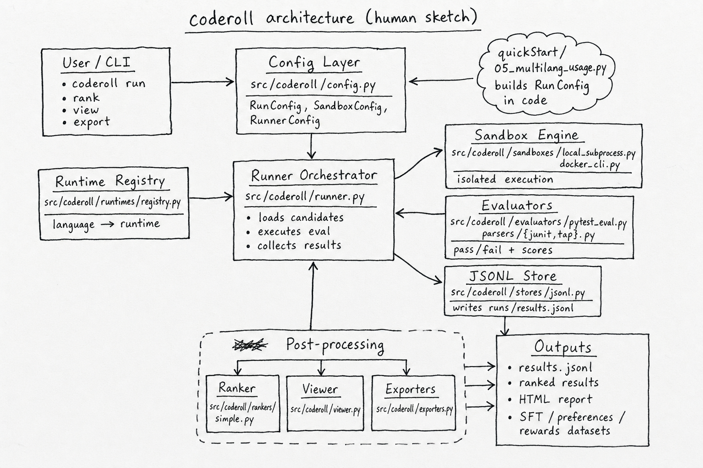

# coderoll

`coderoll` is a local-first Python tool to evaluate AI-generated code in Docker sandboxes. It runs candidates, executes tests, and writes JSONL results for ranking, inspection, and export.

## Quickstart

```bash
# 1) Optional: enable YAML configs
pip install "coderoll[yaml]"

# 2) Create a starter config
coderoll init-config experiment.yaml

# 3) Run the experiment
coderoll run experiment.yaml

# 4) View top results
coderoll rank runs/results.jsonl --top 5
```

## Basic Quickstart Examples

```bash
# inspect one candidate
coderoll inspect runs/results.jsonl --id CANDIDATE_ID

# open the HTML report in browser
coderoll view runs/results.jsonl

# export training datasets
coderoll export runs/results.jsonl --format sft --out datasets/sft.jsonl
```

```bash
# quick project-mode flow (scaffold, run, report)
coderoll init my-task
coderoll run my-task --candidates my-task/candidates.jsonl --out runs/my-task_results.jsonl
coderoll view runs/my-task_results.jsonl
```

More SDK-style examples are available in `quickStart/README.md`.

```bash
# multi-language SDK usage (python/js/ts + optional go config)
uv run python quickStart/05_multilang_usage.py

# optional: run go too when you have a go config
uv run python quickStart/05_multilang_usage.py --go-config path/to/go/experiment.toml

# sandbox execution quickstart (single code snippet -> stdout)
uv run python quickStart/06_sandbox_execution.py
```

Minimal SDK sandbox example (from `quickStart/06_sandbox_execution.py`):

```python
from pathlib import Path
from coderoll.config import (
    CandidatesConfig, EvalCommandConfig, EvalConfig, FileConfig, OutputConfig,
    RankConfig, RunConfig, RunnerConfig, SandboxConfig, SetupConfig, ViewerConfig,
)
from coderoll.runner import run_from_config

config = RunConfig(
    id="sdk_sandbox_stdout",
    mode="file",
    language="python",
    project=None,
    file=FileConfig(code_file="solution.py", test_file="test_solution.py"),
    candidates=CandidatesConfig(path=Path("runs/quickstart_inline_candidates.jsonl"), type="jsonl"),
    setup=SetupConfig(commands=[]),
    eval=EvalConfig(
        commands=[EvalCommandConfig(name="run_code", command="python solution.py", result_format="exit_code")]
    ),
    output=OutputConfig(path=Path("runs/sdk_sandbox_stdout.jsonl")),
    rank=RankConfig(enabled=False),
    runner=RunnerConfig(workers=1),
    sandbox=SandboxConfig(image="coderoll-python:3.11", timeout=10, network=False),
    viewer=ViewerConfig(enabled=False),
    raw={},
    base_dir=Path(".").resolve(),
)

results = run_from_config(config)
print(results.records[0].stdout.strip())
print("jsonResult:", config.output_path)
```

## Architecture Diagram



## CLI Usage

Setup

```bash
coderoll --help
coderoll init TASK_DIR
coderoll init-config PATH [--force]
coderoll build-image [--runtime go|java|javascript|python|rust|typescript] [--tag TAG]
coderoll validate-config CONFIG.{toml,yaml,yml}
```

Run

```bash
coderoll run [TASK_DIR or CONFIG]
```

Analyze

```bash
coderoll rank RESULTS.jsonl [--top N]
coderoll inspect RESULTS.jsonl --id CANDIDATE_ID
coderoll view RESULTS.jsonl
```

Export

```bash
coderoll export RESULTS.jsonl --format {sft,preference,rewards} --out DATASET.jsonl
```

## Supported Languages

- Python
- Go
- Java
- JavaScript
- Rust
- TypeScript
