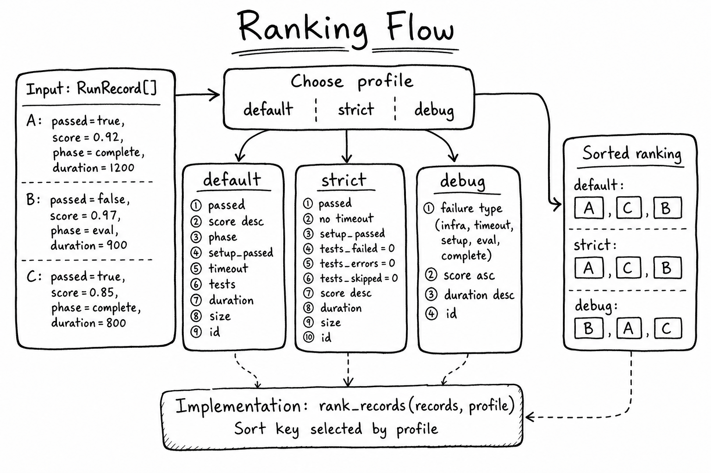

# coderoll

`coderoll` is a local-first Python (dependency free) tool to run code in Docker sandboxes and evaluate AI-generated candidates. Use it either for simple script execution or for eval-command pipelines that produce RL-ready JSONL data.

## Quickstart

```bash
# 1) Optional: enable YAML configs
pip install "coderoll[yaml]"

# 2) Create a starter config
coderoll init-config experiment.yaml

# 3) Run the experiment
coderoll run experiment.yaml

# 4) View top results
coderoll rank runs/results.jsonl --top 5
```

## Basic Quickstart Examples

```bash
# inspect one candidate
coderoll inspect runs/results.jsonl --id CANDIDATE_ID

# open the HTML report in browser
coderoll view runs/results.jsonl

# export training datasets
coderoll export runs/results.jsonl --format sft --out datasets/sft.jsonl
```

```bash
# quick project-mode flow (scaffold, run, report)
coderoll init my-task
coderoll run my-task --candidates my-task/candidates.jsonl --out runs/my-task_results.jsonl
coderoll view runs/my-task_results.jsonl
```

More SDK-style examples are available in `quickStart/README.md`.

## Two Ways To Use Coderoll

1. Simple execution: run your script in sandbox and get output directly.
2. Evaluation pipeline: run setup/eval commands over candidate sets and generate ranked results + RL datasets.

config equivalents (same run in TOML  and YAML):

```toml
id = "quickstart_file_mode"
mode = "file"
language = "python"
output = "runs/file_mode_results.jsonl"

[file]
code_file = "solution.py"
test_file = "test_solution.py"

[candidates]
path = "example/python/project/simple/candidates_100.jsonl"
type = "jsonl"

[setup]
commands = []

[[eval.commands]]
name = "tests"
command = "python -m pytest -q test_solution.py --junitxml=.coderoll-results.xml"
result_format = "junit"

[eval]
stop_on_first_failure = false
score_strategy = "weighted"

[rank]
enabled = true
profile = "default"

[runner]
workers = 2

[sandbox]
image = "coderoll-python:3.11"
timeout = 10
memory = "512m"
cpus = "1"
pids_limit = 128
network = false

[viewer]
enabled = true
out = "runs/file_mode_results.viewer.html"
open = false
```

```yaml
id: quickstart_file_mode # Run identifier shown in outputs/reports
mode: file # File-mode evaluation (code file + tests)
language: python # Runtime/language for candidate execution
output: runs/file_mode_results.jsonl # JSONL results output path

file:
  code_file: solution.py # File where each candidate solution is written
  test_file: test_solution.py # Test file executed during eval

candidates:
  path: example/python/project/simple/candidates_100.jsonl # Input candidate set
  type: jsonl # Candidate file format

setup:
  commands: [] # Optional pre-eval setup commands

eval:
  commands:
    - name: tests # Label for this eval command
      command: python -m pytest -q test_solution.py --junitxml=.coderoll-results.xml # Test command
      result_format: junit # Parse output as JUnit test results
  stop_on_first_failure: false # Continue remaining commands after a failure
  score_strategy: weighted # Scoring policy (currently validated config option)

rank:
  enabled: true # Enable post-run ranking
  profile: default # Ranking profile: default|strict|debug

runner:
  workers: 2 # Number of parallel workers

sandbox:
  image: coderoll-python:3.11 # Docker image used for execution
  timeout: 10 # Per-candidate timeout in seconds
  memory: 512m # Container memory limit
  cpus: "1" # CPU quota/limit
  pids_limit: 128 # Max processes inside container
  network: false # Disable network access for safety/repro

viewer:
  enabled: true # Generate HTML report
  out: runs/file_mode_results.viewer.html # HTML report output path
  open: false # Auto-open report after run
```

```bash
# multi-language SDK usage (python/js/ts + optional go config)
uv run python quickStart/05_multilang_usage.py

# optional: run go too when you have a go config
uv run python quickStart/05_multilang_usage.py --go-config path/to/go/experiment.toml

# sandbox execution quickstart (simple execute -> stdout)
uv run python quickStart/06_sandbox_execution.py
```

Minimal simple execution SDK example:

```python
from pathlib import Path
from coderoll.simple import SandboxConfig, execute_simple

sandbox = SandboxConfig(
    image="coderoll-python:3.11",
    timeout=10,
    memory="256m",
    cpus="1",
    pids_limit=128,
    network=False,
)

# Inline code string
inline_result = execute_simple(
    sandbox=sandbox,
    language="python",
    code="print('hello from inline code')",
)
print(inline_result.stdout.strip())

# File input
result_from_file = execute_simple(
    sandbox=sandbox,
    language="python",
    file=Path("script.py"),
)
print(result_from_file.stdout.strip())
```

## Architecture Diagram


## RANKING FLOW



Ranking is performed by `rank_records(records, profile=...)` in `src/coderoll/rankers/simple.py`.
The function chooses a profile-specific sort key, then returns `sorted(records, key=key_fn)`.

Profiles:

1. `default`
Best for general leaderboard quality.
Priority order: passed first -> higher score -> better phase -> setup success -> not timed out -> better test pass ratio -> fewer failed/error/skipped tests -> lower duration -> smaller candidate -> candidate_id.

2. `strict`
Best when you want reliability over partial wins.
Priority order: passed first -> not timed out -> setup success -> zero failed tests -> zero test errors -> zero skipped tests -> higher score -> lower duration -> smaller candidate -> candidate_id.

3. `debug`
Best for triage and failure investigation.
Priority order: failure type first (`infra` -> `timeout` -> `setup` -> `eval` -> `complete`) -> lower score first (to surface weak outputs) -> longer duration first -> candidate_id.

Example (same 3 candidates, different profile intent):

Candidate A: `passed=True`, `score=0.92`, `phase=complete`, `duration_ms=1200`
Candidate B: `passed=False`, `score=0.97`, `phase=eval`, `duration_ms=900`
Candidate C: `passed=True`, `score=0.85`, `phase=complete`, `duration_ms=800`

Expected ranking:

`default`: `A`, `C`, `B` (pass/fail dominates score)
`strict`: `A`, `C`, `B` (clean pass gates dominate)
`debug`: `B`, `A`, `C` (failure surfaced first)
 

## CLI Usage

Setup

```bash
coderoll --help
coderoll init TASK_DIR
coderoll init-config PATH [--force]
coderoll build-image [--runtime go|java|javascript|python|rust|typescript] [--tag TAG]
coderoll validate-config CONFIG.{toml,yaml,yml}
```

Run

```bash
coderoll run [TASK_DIR or CONFIG]
```

Analyze

```bash
coderoll rank RESULTS.jsonl [--top N]
coderoll inspect RESULTS.jsonl --id CANDIDATE_ID
coderoll view RESULTS.jsonl
```

Export

```bash
coderoll export RESULTS.jsonl --format {sft,preference,rewards} --out DATASET.jsonl
```

## Supported Languages

- Python
- Go
- Java
- JavaScript
- Rust
- TypeScript
